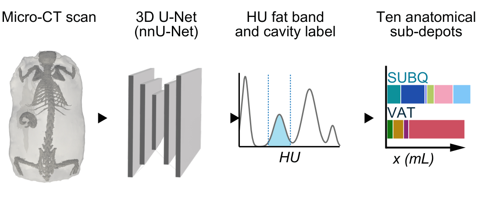

<p align="left">
  <span style="display:inline-block; vertical-align:middle; margin-right:12px;">
    
  </span>
  <span style="display:inline-block; vertical-align:middle;">
    
  </span>
</p>


## CTAdipo — Model Overview

**CTAdipo** measures **visceral (VAT)** and **subcutaneous (SUBQ)** adipose tissue, plus **ten named sub-depots**, from a **microCT volume** of a mouse. One upload in; volumes in millilitres and masses in grams out, with quality flags and rotatable 3-D renders. It couples a segmentation model (body / abdominal wall / cavity), a landmark model that places five craniocaudal anatomical planes, and the lab's validated depot-measurement code. **Try the online version:** https://fullerlabtools.shinyapps.io/ctadipo/

Sibling tool to **DEXAdipo** (https://github.com/fuller-labtools/dexadipo-ai), which predicts the same two compartments from a planar DEXA image.

---

### Why this model?

A volumetric CT already contains the information needed to separate visceral from subcutaneous fat and to name the individual depots — but extracting it has required a human. CTAdipo removes that step. The five planes are predicted directly from the volume, the head-to-tail direction falls out of them (the lung apex is either cranial or caudal of the bladder), and the dorsoventral axis comes from geometry with a manual override. What is left for the user is one upload and one number — the voxel size.

---

### What the model expects (inputs)

- **Imaging modality:** a **3-D microCT volume** of a mouse. A whole-body scan gives all ten depots; a partial scan gives the totals and whichever depots it covers.
- **File formats:** DICOM series (a folder, a `.zip`, or all loose slices), NIfTI (`.nii` / `.nii.gz`), TIFF stack (`.tif` / `.tiff`), NumPy (`.npy` / `.npz`), HDF5 (`.h5` / `.hdf5`).
- **Voxel size (mm):** the one setting that matters. It is read from the file where the format carries it — DICOM, NIfTI, ImageJ TIFF — and **must be typed in for NumPy and plain TIFF**, which carry none. Every volume scales with the cube of it, so a wrong value gives plausible numbers that are badly wrong. Anisotropic scans are accepted; all three axes are shown and used.
- **Resampling:** everything is resampled internally to a **0.15 mm isotropic grid** before anything is measured.
- **HU calibration is not assumed.** The fat band is chosen from each scan's own air percentile, because the source data is not HU-calibrated either — the air peak runs from **−773 to −1424 HU** across the two scanners that produced it.

---

### What the model produces (outputs)

- **Totals**, in mL and in g: **VAT**, **SUBQ**, **total fat**.
- **Ten sub-depots** that tile VAT and SUBQ exactly:

| visceral | subcutaneous |
|---|---|
| perigonadal | anterior (interscapular) |
| mesenteric / omental | dorsolumbar |
| retroperitoneal | inguinal |
| thoracic | gluteal |
| | hindlimb |
| | head / neck |

- **Five landmark planes** (lung apex, diaphragm, cranial kidney, caudal kidney, bladder), the implied **craniocaudal direction**, and a **confidence** for each — the spread of the predicted distribution.
- **Quality flags:** abdominal-wall support for the VAT/SUBQ split, landmark order, landmark confidence, direction margin, whether lung was removed, and a check for a volume with implausibly little fat inside the band.
- **A 3-D view** of the ten depot masks, drawn in the browser with WebGL, and a **CSV** of everything above.

Volumes convert to mass at **0.9 g/cm³**.

The depot rules also compute several *overlapping* regions — `posterior_SUBQ_whole`, `interscapular`, `perirenal_proxy`, `mediastinal`, `preperitoneal` and two lumbar windows. They are deliberately kept out of the results table and the CSV: they overlap each other and the ten, and do not sum to anything. Separately, the rules mark some depots **provisional**, meaning their definition is not settled; two of the ten (`mesenteric` and `thoracic`) are on that list, and the app flags them with an asterisk rather than presenting them as settled.

---

### Training data and ground truth

**Landmark model**

- **Data:** **1,186 expert-reviewed scans from 856 animals**, acquired on two scanners. 637 animals were scanned once, 108 twice and 111 three times, so **549 of the 1,186 scans share an animal with another scan**
- **Labels:** the five craniocaudal planes as placed and corrected by an expert reviewer, scan by scan.
- **Validation split:** **5-fold cross-validation, grouped by animal.** The cohort scans the same mouse at up to three timepoints, so a per-scan split would put one animal's baseline in training and its 12-month scan in validation, and report a number that means nothing for a new mouse.

**Segmentation model**

- **Dataset:** `Dataset112_MouseAdiposeWallHU`, labelled volumes with three foreground classes — `outer_body` (1), `abdominal_wall` (2), `cavity` (3), on background (0).
- **Published model:** configuration `3d_lowres`, ResEnc-M plans, trainer `nnUNetTrainer_100epochs`, **fold 0 only**, `checkpoint_final.pth`. Fold 0 is not a shortcut: averaging five folds would be a better model and would *not* reproduce the locked cohort these measurements have to agree with.

---

### Architecture

**1. Landmark model** (ours; `ctadipo/landmark_model.py`, weights in `model/fold0.pt` … `model/fold4.pt`)

- **Input:** two body-masked orthogonal projections (coronal, sagittal), **four channels each** — `bone` = max inside body, `air` = min inside body, `bulk` = mean inside body, `thickness` = body depth in mm — resized to **256 (z) × 128 (lateral)**, standardised per scan over body pixels only, plus one validity channel per view = **10 input channels**.
- **The body mask** is the largest 3-D connected component above −500 HU **with holes filled**. Filling is essential: the lungs sit below the threshold, so unfilled they are excluded and the air channels lose the one structure the thoracic landmarks are defined on.
- **Encoder:** 2-D, five blocks of 32/48/64/96/128, and **every pool is (1,2)** — lateral only, so z stays at 256 rows end to end. Lateral detail can be discarded; z resolution *is* the answer.
- **Trunk:** lateral mean + max pooling into a **7-layer dilated `Conv1d` residual trunk** (dilations 1, 2, 4, 8, 16, 32, 64) plus a global-context vector, so each row's receptive field spans the whole animal — which it needs in order to know which end is the head.
- **Head:** a `Conv1d` giving **five distributions over z**. Position is read by **soft-argmax**; the **spread of the distribution is the confidence**. Folds are averaged in probability space rather than by averaging their scalar answers, so two folds disagreeing give a visibly bimodal, low-confidence result instead of a confident answer halfway between them.
- **Size:** **0.92 M parameters, 3.5 MB per fold** — five folds, 18 MB, shipped in this repository.
- **Training:** 120 epochs, AdamW **lr 3e-4** with OneCycle, batch 16. **Loss** = cross-entropy to a Gaussian centred on the truth (**sigma 3 bins**) + **0.1 × L1** on the soft-argmax expectation.
- **Augmentation:** craniocaudal flip (this is what removes the need for a reviewed direction table), field-of-view crop, per-channel intensity jitter, Gaussian noise.

**2. Segmentation model** (nnU-Net; `ctadipo/segment.py`)

- `Dataset112_MouseAdiposeWallHU`, `3d_lowres`, ResEnc-M plans, `nnUNetTrainer_100epochs`, fold 0. **383.5 M parameters.**
- `dataset.json` declares **`noNorm`**, so nnU-Net applies no normalisation of its own and **the caller's z-scoring *is* the normalisation**. Statistics come from the animal, never from a per-slice body mask. Passing a raw volume produces a confident, wrong segmentation.
- The published checkpoint is **410 MB**: optimizer and grad-scaler state removed from the 819 MB training checkpoint. Removing them was **verified to give bit-identical labels** through the same code path.
- Eight-fold **mirroring is on by default**, because that is what the published numbers used.

**3. Measurement pipeline** (`ctadipo/pipeline.py`, `ctadipo/preprocess.py`)

```text
volume → 0.15 mm isotropic → animal mask → z-score → nnU-Net (body / wall / cavity)
       → HU fat band → lung removed → five landmark planes → ten depots → mL and g
```

- **Fat band, chosen per scan:** `[-491, -118]` HU when the scan's 1st-percentile air is below −1050 HU, otherwise `[-490, -200]`.
- The band is applied to a **3×3×3 median-filtered** volume. Against **709 hand-placed fat points** this keeps **645/709 (91.0%)** versus **576/709 (81.2%)** on the raw volume, and admits fewer false positives. The median filter is used for the band only; everything else reads the unfiltered volume.
- **Lung is subtracted.** Lung reads −300 to −400 HU, inside the band, so unsubtracted it is counted as fat: measured at **~16% of a lean animal's total fat against ~1.5% of an obese one's** (r = −0.83 with log total fat) — a bias along the adiposity axis itself, not a wash.
- **VAT = fat inside the cavity; SUBQ = fat outside it.** The ten sub-depots are slabs cut at the five landmarks.
- Volumes convert to mass at **0.9 g/cm³**.
- The measurement itself is the lab's validated `depot_rules`, **vendored and called unchanged** — CTAdipo builds the exact mask dictionary it expects rather than reimplementing ten depot definitions.

---

### Performance (held-out validation)

**Landmark placement.** Cross-validated on all 1,186 reviewed scans, **grouped by animal**; every number below is out of fold.

| plane | median absolute error | p90 |
|---|---|---|
| lung apex | **0.51 mm** | 1.54 mm |
| diaphragm | **0.48 mm** | 2.22 mm |
| kidney, cranial | **0.66 mm** | 2.07 mm |
| kidney, caudal | **0.79 mm** | 2.60 mm |
| bladder | **0.84 mm** | 2.70 mm |

**Craniocaudal direction: 99.66%** (1,182 / 1,186). The four misses are not silent: on those the apex and bladder come out **0.4–25.1 mm** apart, against a **1st percentile of 29.4 mm** when the call is right — so a **margin under 28 mm flags all four while flagging under 1% of scans**. This matters because a direction flip swaps anterior with gluteal, and retroperitoneal with perigonadal, while conservation holds exactly and every total looks perfectly normal.

**Where it fails.** **6.2%** of scans exceed 5 mm on at least one plane and **2.0%** exceed 10 mm. The confidence flag catches **73% of the > 5 mm cases** at the cost of flagging **10.9%** of scans. That is useful, not a guarantee — look at the 3-D view.

**What that means for the depot volumes.** Millimetres of plane are only a proxy; millilitres of named depot are the main output. So it was measured directly: **60 scans, the model's landmarks against the expert's, with identical masks in both arms**, so the annotation is the only variable.

- Median difference per depot ranges from **1.2% (perigonadal)** to **8.1% (inguinal)**; in absolute terms **0.01–0.10 mL** in every depot regardless of its size, which is what a ~1 mm plane shift moving a thin sheet of fat across a boundary looks like. It does not compound.
- **Total fat, VAT and SUBQ are unaffected — 0.00% median difference** — because landmarks only redistribute fat between slabs and cannot change how much of it there is.
- **Direction agreed on 60/60**, and no scan failed to partition.

**But an individual small depot on an individual scan can differ by tens of percent.** The percentage is larger on small depots only because they are small; at the p90 the per-scan difference reaches roughly 50% for thoracic and 48% for inguinal. Treat the large depots as precise, the small ones as indicative, and the totals as exact.

**The rest of the chain.** Preprocessing reproduces the source pipeline **bit-exactly** — body, cavity, fat, VAT and SUBQ masks — so the compartment totals depend only on the segmentation and the HU band, neither of which the landmark model touches.

**Runtime (CPU, one scan; measured on a 489 × 427 × 427 volume — a 540 × 529 × 529 is ~1.7× more):**

| cores | fast mode (no mirroring) | mirroring on |
|---|---|---|
| 2 | 75 s | ~10 min |
| 8 | 46 s | ~6 min |

Re-measured end to end on a 540 × 529 × 529 scan on the 24-core desktop in 1.3: **11.2 min with mirroring against 3.2 min without**. So fast mode is roughly **3–4× faster, not 8×**, and wall clock moves with machine load — the same fast run took 3.2 and 4.7 min on two attempts. Read the table as an order of magnitude, not a specification.

On that scan, a lean animal with 1.06 mL of fat, turning mirroring off moved total fat by **+1.9%** (1.064 → 1.084 mL). Across the six scans it was measured on the median shift is **−0.02%** with a worst case of 2.7% — so the effect is small in the middle of the range and not small in the tail. **Fast mode is for triage; the published configuration is mirroring on.**

---

### Intended use & limitations

- **Research use only**; not a clinical or diagnostic device.
- **Hardware-specific holder geometry is deliberately not shipped, and fused hardware may be counted as fat.** The source pipeline subtracts hand-drawn polygons keyed to scanner *and* reconstruction crop, because on that rig a breathing pad fuses to the animal and its dark interior is labelled cavity — i.e. counted as visceral fat. Those polygons cannot transfer to another scanner. CTAdipo does only what generalises (`keep_largest3d`, which removes *detached* hardware) and **shows you the mask**
- **The data is not HU-calibrated**, so the fat band is chosen per scan from its own air percentile rather than from an assumed calibration. A genuinely HU-calibrated scan puts adipose at roughly −190 to −30 HU, which barely overlaps either band; such a scan is flagged as having implausibly little fat in the band rather than being reported as ~0 mL with a clean panel.
- **Voxel size is not recoverable from the image.** For NumPy and plain TIFF it must be entered, and nothing downstream can detect a wrong value — every volume scales with its cube.
---

### Getting started (quick)

- **Online version:** https://fullerlabtools.shinyapps.io/ctadipo/ — upload a volume, confirm the voxel size, press *Measure adipose depots*.
- **Locally:**

```bash
git clone https://github.com/fuller-labtools/ctadipo-ai.git
cd ctadipo-ai
pip install --index-url https://download.pytorch.org/whl/cpu torch==2.5.1
pip install -r requirements.txt
shiny run --reload app.py
```

The landmark weights are in this repository. The 410 MB segmentation checkpoint is fetched from Zenodo on first use and cached; nothing else needs downloading by hand. Guidance for the Shiny app, the local Python demo, training, and inference on your own data is in the sections below. See [DEPLOY.md](DEPLOY.md) for hosting.

---

### 1. System requirements

### 1.1 Operating systems

CTAdipo is implemented in Python and PyTorch and should run on any 64-bit OS those support:

- Windows 10/11 (native Python or WSL2) — **this is what it was developed and tested on**
- Linux
- macOS (Intel or Apple Silicon, via a compatible Python + PyTorch installation)

**Honest caveat:** every measurement quoted here was produced on Windows. The shipped code was audited for Linux-specific hazards and came back clean — no absolute paths, no subprocess or conda calls, no `matplotlib` config-dir problem, a zip-slip guard correct under `os.sep = '/'`, and nnU-Net 2.8.0 needing no `nnUNet_*` environment variables for inference — but an audit is not an execution. Watch the first run's log.

### 1.2 Software dependencies

Core Python dependencies (the pinned set is in `requirements.txt`):

- Python **3.10–3.12** (3.11 is the tested target; below 3.10 the `X | None` annotations fail at import, and 3.13 has no wheels for several pins)
- `torch==2.5.1` — **install the CPU wheel.** The plain PyPI build is a 906 MB CUDA wheel that hard-pins twelve `nvidia-cu12` packages, none of which is used here. The `--extra-index-url` line at the top of `requirements.txt` is what selects the 175 MB CPU build; it is load-bearing, not a comment.
- `nnunetv2==2.8.0`
- `numpy==2.0.1`, `scipy==1.15.3`, `pandas>=2.0`, `Pillow>=9.5`
- `SimpleITK==2.5.3`, `pydicom>=2.3`, `tifffile>=2023.7.10`, `h5py>=3.9` — volume I/O
- `scikit-image>=0.21`, `trimesh>=4.0`, `fast-simplification>=0.1`, `plotly>=5.18` — meshes for the 3-D view
- `shiny>=0.8`, `requests>=2.31`

```bash
pip install --index-url https://download.pytorch.org/whl/cpu torch==2.5.1
pip install -r requirements.txt
```

**`pyvista` cannot be used** and must not be added: it needs a graphics context, which neither deployment host has. The server builds meshes with marching cubes (pure arithmetic, no OpenGL) and the browser draws them with WebGL.

### 1.3 Versions tested

Tested on the following configuration:

- OS: Windows 11 Enterprise 10.0.26200 (build 26200)
- System type: 64-bit operating system, x64-based processor
- CPU: 13th Gen Intel(R) Core(TM) i9-13900KF, 24 cores / 32 threads
- RAM: 63.8 GB
- GPU: NVIDIA GeForce RTX 4080 (driver 591.86)
- Python: 3.11 (supported range 3.10–3.12)
- torch: 2.5.1 (CPU wheels for deployment)
- nnunetv2: 2.8.0
- numpy: 2.0.1 · scipy: 1.15.3 · SimpleITK: 2.5.3 · shiny: ≥ 0.8

### 1.4 Non-standard hardware

**Inference / demo: none. A GPU is not required and is not used** — the shipped code runs on CPU, which is also how the hosted app runs. What matters instead is **RAM**: one scan peaks at **5–6 GB**, so a 1 GB container will be killed. Runtimes are in *Performance* above.

**Training:** an NVIDIA GPU is strongly recommended. The nnU-Net segmentation model in particular is not a CPU proposition. The landmark model is small — 0.92 M parameters on 256 × 128 projections — and trains comfortably on a single consumer GPU such as the RTX 4080 in 1.3.

---

### 2. Installation guide

### 2.1 Instructions

Clone the repository

```bash
git clone https://github.com/fuller-labtools/ctadipo-ai.git
cd ctadipo-ai
```

Create and activate a fresh Python environment (recommended)

```bash
# Linux/macOS
python -m venv ctadipo_env
source ctadipo_env/bin/activate
# or, on Windows:
ctadipo_env\Scripts\activate
```

Install dependencies — **the CPU torch line first**

```bash
pip install --upgrade pip
pip install --index-url https://download.pytorch.org/whl/cpu torch==2.5.1
pip install -r requirements.txt
```

Run the app

```bash
shiny run --reload app.py
```

### Pretrained model weights

**Landmark model — already in this repository.** `model/fold0.pt` … `model/fold4.pt` (3.5 MB each, 18 MB in total), loaded by `ctadipo.landmark_model.load()`. `model/oof.npz` holds, for all 1,186 scans, the out-of-fold predictions, the reviewed truths, the per-plane error in mm, the fold index and an anonymous animal index — enough to recompute every accuracy figure above and to confirm that no animal is split across folds. Scan identifiers are deliberately not in it: they are cohort animal identifiers, and the roster is not published with this repository. Point `CTADIPO_LANDMARKS` at another directory to use your own folds.

**Segmentation model — fetched on first use.** The 410 MB nnU-Net checkpoint is too large for a git repository, so `ctadipo/models.py` downloads it once into a writable cache, verifies its SHA-256, writes to a temporary name and renames atomically so an interrupted download can never be mistaken for a complete one, and takes a lock so two sessions cannot both pull it into the same path. No manual step is needed. The two small JSONs it needs (`dataset.json` and `plans.json`, 17 KB between them) ship in `nnunet/`.

Published on Zenodo, **record 22947300**:

```text
checkpoint (410 MB)
https://zenodo.org/records/22947300/files/checkpoint_final.pth?download=1
sha256 87c814c3e771ea0d65cf036c61155f4d301a0db17d252346490d921dcdafe80a

landmark folds (also in this repo; published so they are citable)
https://zenodo.org/records/22947300/files/ctadipo_landmarks.zip?download=1
```

To fetch the checkpoint by hand instead, place it at
`<root>/Dataset112_MouseAdiposeWallHU/nnUNetTrainer_100epochs__nnUNetResEncUNetMPlans__3d_lowres/fold_0/checkpoint_final.pth`
and set `CTADIPO_NNUNET=<root>`.

Environment variables, all optional:

| variable | effect |
|---|---|
| `CTADIPO_LANDMARKS` | directory holding `fold*.pt` (default: `./model`) |
| `CTADIPO_NNUNET` | an nnU-Net results root that **already** holds the checkpoint; nothing is downloaded while it is there |
| `CTADIPO_CACHE` | where the fetched checkpoint is cached (default: system temp) |
| `CTADIPO_CKPT_URL` / `CTADIPO_CKPT_SHA256` | override the published checkpoint |
| `CTADIPO_THREADS` | CPU threads. Unset, the order is: the cgroup quota where there is one, then the process affinity, then `os.cpu_count()` — so on Windows or a bare host it takes every core, which is worth capping by hand |
| `CTADIPO_MEM_BUDGET_GB` | working-memory budget in GB; the ceiling on how large a volume is accepted after resampling (app default 6.1, `CTAdipo_inference.py` default 16) |
| `CTADIPO_DEPOT_RULES` | path to a development copy of `depot_rules.py` |

### 2.2 Typical install time

Creating the environment and installing the dependencies takes a few minutes on a normal connection; the download is dominated by the 175 MB CPU `torch` wheel. Add the **one-off 410 MB checkpoint fetch on the first run** — Zenodo served it to us at about 1 MB/s, so budget roughly 7 minutes before the first measurement starts. It is cached afterwards, and the app begins that download when a scan is *uploaded* rather than when *Run* is clicked, so it overlaps with the user checking the voxel size.

---

### 3. Demo

### 3.1 Demo via the Shiny app

Go to **https://fullerlabtools.shinyapps.io/ctadipo/** and:

1. **Upload one microCT volume** — NIfTI, TIFF stack, NumPy, HDF5, or a DICOM series (select every slice, or upload a `.zip` of them).
2. **Check the voxel size.** It is filled in from the file where the format carries it, and must be typed in otherwise. Anisotropic scans show three separate boxes.
3. Leave **Orientation** on *Detect automatically* unless the 3-D view comes back with the back and belly swapped.
4. Optionally switch on **Fast mode**, which skips mirroring — about 3–4× faster. It shifted total fat by −0.02% at the median across six scans, but by +1.9% on one lean animal, so use it for triage. The default is mirroring on, which is the published configuration.
5. Click **Measure adipose depots**.

**Expected run time (demo via Shiny):** a few minutes in fast mode and **roughly 6–12 minutes with mirroring**, depending on the volume and on how many cores the instance has (see *Performance*). A cold container adds the one-off model download. A progress line names each step as it runs.

**What you get back:** total fat, VAT and SUBQ in mL and g; the ten sub-depots as a table with each depot's share of total fat; the quality panel; a rotatable 3-D view of the ten depot masks; and a **Download CSV** button.

> **Note:** unlike DEXAdipo, the CTAdipo app does **not** bundle an example scan — a single microCT volume is hundreds of megabytes, and the cohort scans are not distributed with this repository. Use one of your own, or any whole-body mouse microCT volume.

### 3.2 Local Python demo

The Shiny app is a thin wrapper over a headless core, so the same numbers can be produced without a browser:

```python
from pathlib import Path
from ctadipo import io_any, pipeline, landmark_model as LMM, segment, models
from ctadipo.vendor import depot_rules
from ctadipo.vendor.lung import lung_air

# 1. read the volume; spacing comes from the file when the format carries it
vol, spacing, meta = io_any.read_any(Path("demo/mouse.nii.gz"))
print(meta["kind"], meta["shape"], spacing)

# spacing = (0.15, 0.15, 0.15)   # <- set this by hand for .npy / plain .tif
raw = io_any.to_isotropic(vol, spacing, iso=0.15, max_voxels=400_000_000)

# 2. models. The landmark folds are in this repo; the checkpoint is fetched once.
nets = LMM.load("model", device="cpu")
root = models.ensure_checkpoint()                 # 410 MB on the first call, then cached
seg = segment.load_segmenter(root.parent.parent, device="cpu", mirroring=True)

# 3. measure
out = pipeline.analyse(
    raw, seg, nets,
    lung_fn=lambda r, body: lung_air(r, body, select="peak", coarse=True),
    device="cpu",
    depot_rules=depot_rules,
    aid="demo",
    progress=print,
)

print(out["totals"])            # VAT_mL, SUBQ_mL, TotalFat_mL and the same in grams
print(out["depots"]["mL"])      # the ten sub-depots
print(out["quality"])           # wall support, landmark order, direction, lung, band
print(out["landmarks"]["z"])    # the five planes, in voxels
```

The run prints its steps as it goes:

```text
resampling to the 0.15 mm grid
finding the animal
normalising
segmenting body, wall and cavity
measuring fat
placing landmarks
partitioning into depots
```

and `out["totals"]` has the form:

```text
{'VAT_mL': ..., 'SUBQ_mL': ..., 'TotalFat_mL': ...,
 'VAT_g': ..., 'SUBQ_g': ..., 'TotalFat_g': ...,
 'lung_fat_removed_mL': ..., 'lung_region_mL': ...}
```

**Expected run time (local demo):** as in *Performance* — minutes, not seconds. On the machine in 1.3 a 540 × 529 × 529 scan took 3.2 min with `mirroring=False` and 11.2 min with it on; a smaller volume on fewer cores lands in the range in the table. Add the first-run model download. Peak memory is 5–6 GB for one scan, so run one at a time.

---

### 4. Instructions for use (running on your own data)

### 4.1 Preparing your data

Acquire whole-body mouse microCT volumes and export them in any of the supported formats.

Ensure:

- **The voxel size is known and correct.** If the format does not carry it (NumPy, plain TIFF), you must supply it. Nothing downstream can detect a wrong value.
- **The animal fills the field of view sensibly.** After resampling to 0.15 mm the volume must be at least 128 slices — fewer cannot carry five anatomical planes, and the app says so rather than guessing.
- **Mounting is consistent.** All training scans share one dorsoventral orientation, so a differently mounted animal is outside what has been validated: check the 3-D view and use the override if back and belly come out swapped.
- **Detached hardware is fine; fused hardware is not.** A holder or pad not touching the animal is removed automatically; one fused to it can be labelled cavity and counted as visceral fat. Look at the mask.

No CSV or label file is needed for measurement — one volume in, one row out.

### 4.2 Training from scratch

**The landmark model.** The **feature construction and the network live in `ctadipo/landmark_model.py`**, which is a single module on purpose: training and inference import the same code, so the two cannot drift. The training loop is **`CTAdipo_train.py`** in this repository: `extract` turns volumes and a reviewed label CSV into per-scan `.npz` features, `train` turns those into the five folds plus the out-of-fold report, and `all` runs both. It imports `ctadipo/landmark_model.py` rather than carrying its own copy of the features, which is what stops the trainer and the app drifting apart. Run `python CTAdipo_train.py --help` for the CLI and the label-CSV format. **The training volumes themselves are not redistributed.** The recipe is also specified here in full, so it can be reproduced on your own scans without reading the script:

- **Targets:** the five craniocaudal planes per scan, as fractions of the z axis.
- **Inputs:** `standardise(features(volume, animal_mask(volume)))` → a (10, 256, 128) array. Use `landmark_model.animal_mask` — largest 3-D component above −500 HU, **holes filled**.
- **Splits:** 5-fold cross-validation, **grouped by animal**, never by scan.
- **Optimisation:** 120 epochs, AdamW, lr 3e-4 with OneCycle, batch 16.
- **Loss:** cross-entropy to a Gaussian centred on the truth (sigma 3 bins) + 0.1 × L1 on the soft-argmax expectation.
- **Augmentation:** craniocaudal flip, field-of-view crop, per-channel intensity jitter, Gaussian noise. The flip is what makes a reviewed direction table unnecessary.
- **Output:** one `fold*.pt` state dict per fold in a directory, which `LMM.load()` reads. Five folds at 3.5 MB each.

**The segmentation model.** Standard nnU-Net v2, with the ResEnc-M planner and a 100-epoch trainer:

```bash
nnUNetv2_train 112 3d_lowres 0 -p nnUNetResEncUNetMPlans -tr nnUNetTrainer_100epochs
```

Two things must match, or the app's normalisation will be wrong: `dataset.json` declares **`"noNorm"`** for channel 0, and the label map is `background 0, outer_body 1, abdominal_wall 2, cavity 3`. The caller z-scores the volume over the animal mask, and that *is* the normalisation.

To strip a training checkpoint to the inference-only form before publishing it, remove the optimizer and grad-scaler state (819 MB → 410 MB) and **verify that the labels are bit-identical through the same code path** before trusting it.

### 4.3 Inference

**In the app:** upload, confirm the voxel size, press *Measure adipose depots*, download the CSV. That is the whole workflow.

**From the command line:** `CTAdipo_inference.py` is the headless equivalent of the app — one row of depot volumes per scan, straight into R or pandas. It loads the models once and reuses them across the whole batch.

```bash
python CTAdipo_inference.py scan.nii.gz --out depots.csv
python CTAdipo_inference.py "scans/*.nii.gz" --out depots.csv --fast
python CTAdipo_inference.py dicom_folder/ --out depots.csv
python CTAdipo_inference.py stack.tif --voxel 0.5 0.1 0.1 --out depots.csv   # formats that carry no spacing
```

Run `python CTAdipo_inference.py --help` for the rest (`--threads`, `--device`, `--dorsal`, `--no-lung`). Every number it prints comes from `pipeline.analyse`, so it cannot disagree with the app.

**In your own code:** use the snippet in 3.2 — `pipeline.analyse` returns the totals, the ten depots, the landmarks and the quality flags in one dict. For a batch, load the models **once** (`LMM.load`, `models.ensure_checkpoint`, `segment.load_segmenter`) and loop over volumes; re-loading per scan is pure waste, and two scans in parallel will exhaust the memory of most machines.

**With the nnU-Net CLI**, if you want the segmentation alone, the exact configuration the published numbers used is:

```bash
nnUNetv2_predict -d 112 -c 3d_lowres -f 0 -p nnUNetResEncUNetMPlans \
                 -tr nnUNetTrainer_100epochs -chk checkpoint_final.pth
```

with mirroring left on (no `--disable_tta`), on a volume already resampled to 0.15 mm **and z-scored over the animal mask**.

**Reading the result.** Before using a number, read the quality panel:

- **wall support** — if the abdominal wall is too thin to anchor the cavity, the VAT/SUBQ **split** is untrustworthy while both totals remain fine.
- **landmark order** — the depots require bladder → caudal kidney → diaphragm → lung apex along the body; out of order means the landmarks and the implied direction disagree.
- **landmark confidence** — a wide predicted distribution is a genuine "this scan does not look like the training data" signal.
- **direction margin** — under 28 mm between apex and bladder, treat the head-to-tail call as unverified. A flip swaps anterior with gluteal, and retroperitoneal with perigonadal, while every total looks normal.
- **lung removed** — unremoved lung is counted as fat and inflates lean animals specifically.

---

### Models, code and licence

- **App:** https://fullerlabtools.shinyapps.io/ctadipo/
- **Code:** https://github.com/fuller-labtools/ctadipo-ai
- **Models:** Zenodo record **22947300** — DOI [10.5281/zenodo.22947300](https://doi.org/10.5281/zenodo.22947300)
- **Sibling tool (DEXA-based, same lab):** https://github.com/fuller-labtools/dexadipo-ai
- **Licence:** MIT — see [LICENSE](LICENSE).
